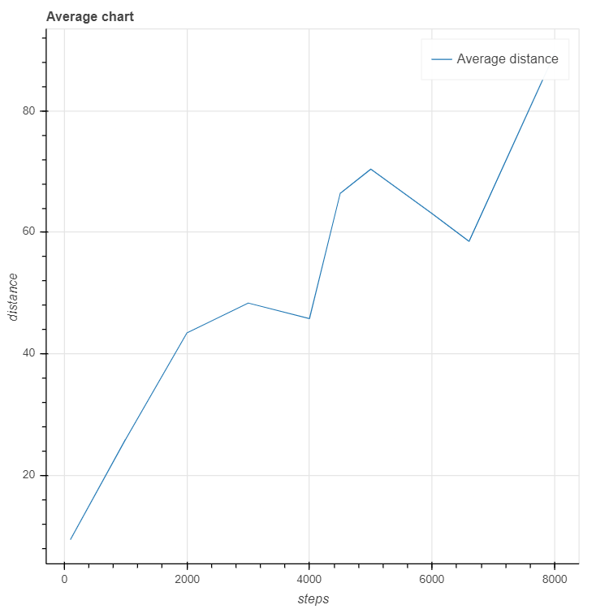
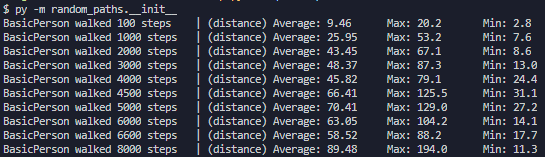
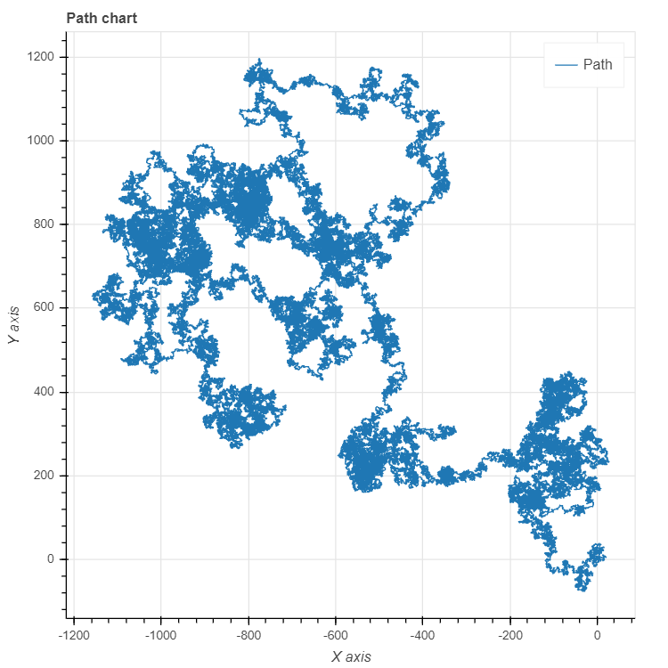
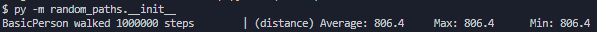

# Execution example

Execution with multiple paths the program will display the average distance between each steps




Execution with single path the program will display the route of the Person thru the Canvas based on the Coordinates




# To execute the project you will need to install the next dependencies

Guide to install the dependencies in the [next link](./../charts/README.md)

```bash
bokeh==2.0.2
Jinja2==2.11.2
MarkupSafe==1.1.1
numpy==1.18.4
packaging==20.4
Pillow==7.1.2
pyparsing==2.4.7
python-dateutil==2.8.1
PyYAML==5.3.1
six==1.15.0
tornado==6.0.4
```
